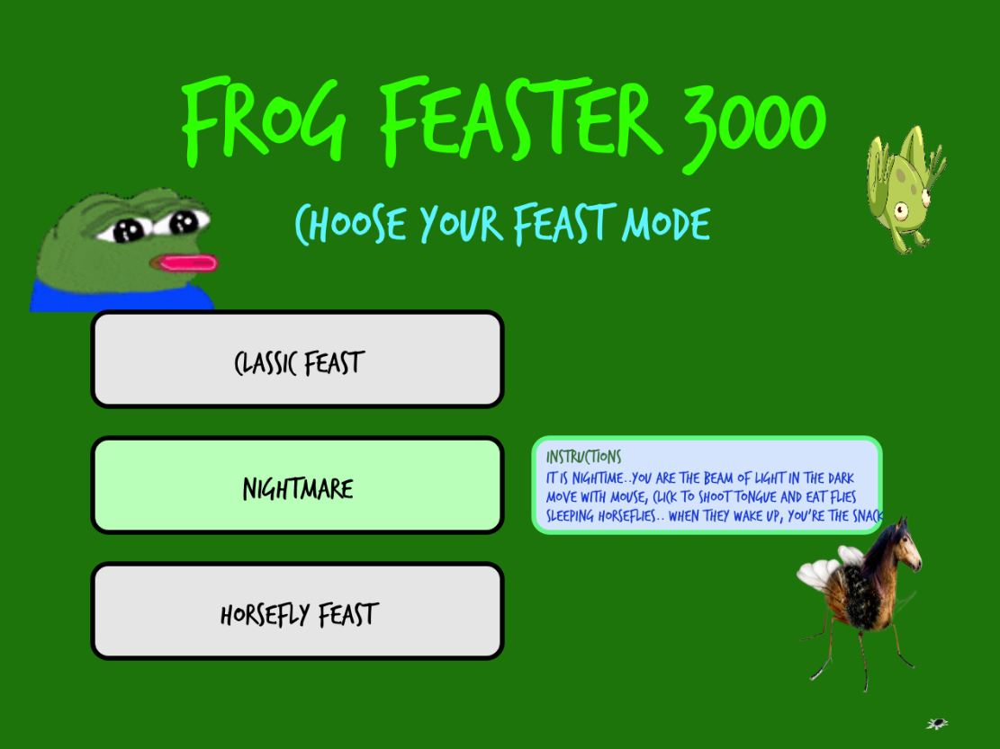
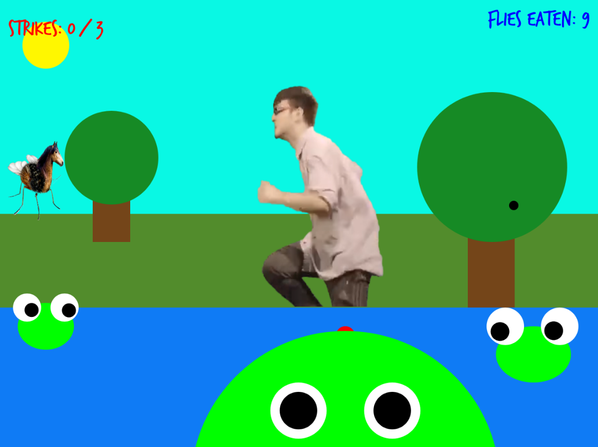
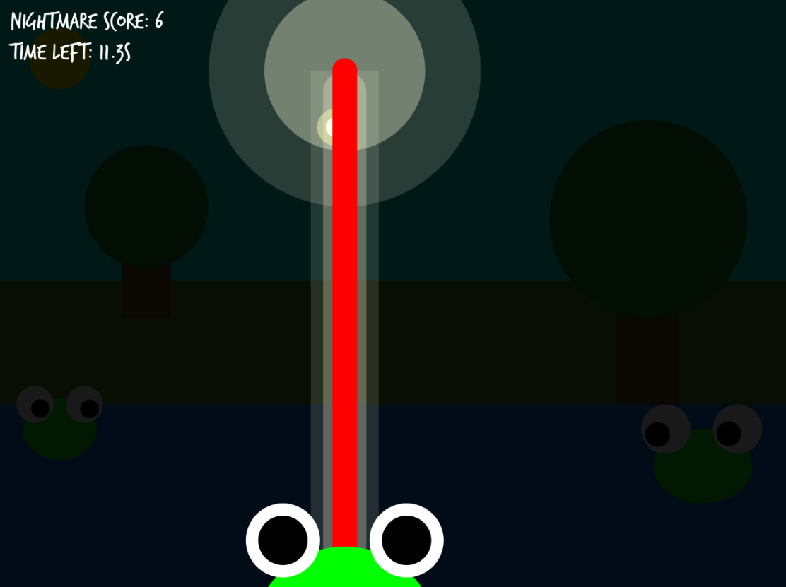
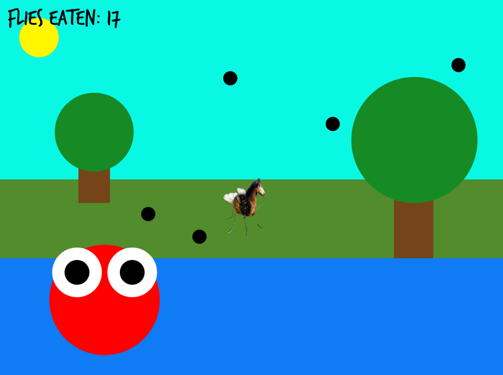

# Frog Feaster 3000

## Overview

Frog Frenzy is an interactive p5.js game where you control a frog to catch flies and avoid a raging horsefly and distractions.
Click to shoot the frog’s tongue, eat flies to score points, and survive as long as possible.

## Game Modes

# Classic Feast (Original Game)

- Mechanics: Move frog with mouse, click to catch flies, avoid horsefly (3 strikes = game over).
- Flow: Frog grows per fly, flies move randomly, every 5 flies → croak, confetti, horsefly speeds up.
- Visuals: Bright, silly, energetic, frog friends watch, horsefly trembles, Filyhyfrank distracts you.
- Goal: Lighthearted and chaotic fun.

# Nightmare Spotlight

- Mechanics: Same controls, only frog-lit spotlight visible.
- Flow: Flies move unpredictably in dark
- Visuals: Dark, horror-inspired, spotlight mask
- Goal: Tense, high-alert gameplay.

# Horsefly Feast

- Mechanics: Play as horsefly, eats flies instantly, red frog hunts you (1 hit = game over).
- Flow: Flies spawn fast, frog jumps aggressively, dodge to survive.
- Visuals: Chaotic, red frog with bulging eyes, smooth horsefly control with mouse.
- Goal: Fast-paced role reversal.

## Credits & Assets

**Audio**

- Background Music - [YouTube](https://www.youtube.com/watch?v=QkilxmkWjTM)
- Frog croak — [YouTube](https://www.youtube.com/watch?v=IMusbT5eJuo)
- Hit sound — [Minecraft Hit - MyInstants](https://www.myinstants.com/en/instant/minecraft-hit-8123/?utm_source=copy&utm_medium=share)
- Mlem — [MyInstants](https://www.myinstants.com/en/instant/mlem-93345/?utm_source=copy&utm_medium=share)

**Visuals**

- Distraction video — [YouTube](https://www.youtube.com/watch?v=w8u2KmW9nxw)
- Horsefly - [Pinterest](https://pin.it/3FtbmGcpb)
- Background soundtrack — [YouTube](https://www.youtube.com/watch?v=QkilxmkWjTM)
- Confetti GIF — [Tenor](https://tenor.com/view/confetti-gif-9112604163635990669)
- Frog GIF — [Tumblr / Tyson Hesse](https://www.tumblr.com/tysonhesse/47413877223/this-is-old-but-i-never-posted-it-well-now-i?source=share)
- Illusion fly GIF — [Tenor](https://tenor.com/Qu48.gif)
- Pepe Bonk GIF — [Tenor](https://tenor.com/oldB3WQ6tca.gif)
- Pepe Scream GIF — [Tenor](https://tenor.com/hQkifn6JXKJ.gif)
- Tongue animation GIF — [Tenor](https://tenor.com/bWx2b.gif)
- Pepe Hungry GIF - [Tenor](https://tenor.com/view/вкусно-gif-26261530)
- Pepe waking up GIF - [Tenor](https://tenor.com/view/woke-wokege-wake-up-sleep-peepowoke-gif-25660689)
- Horror Eye GIF - [Tenor](https://tenor.com/view/eyes-gif-25847243)

Created by Yéléna Arakelian for the Variation Jam project.  
Built with **p5.js**, using logic, visuals, and sound design.
